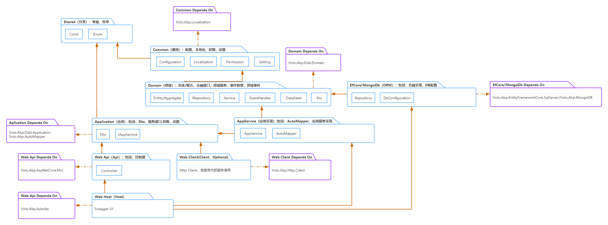

# Template for MicrosoftService module

## How to create solution?

1. download template: `dotnet new --install Maple.Branch.Module`
2. create solution：`dotnet new mt -n {Solution name} -c {Company Name} -p {Projects Name}`

> Uninstall Maple.Leaf.Module: `dotnet new -u Maple.Branch.Module`

## Run solution

1. Because of unknown reasons, the project is not under the folder after generation. Please move by yourself
2. After opening the project in VS, select the project with the suffix 'WebHost' to set as the startup project
3. Set the default project with the suffix `WebHost` and run `Update-Database`, in `Package Manager Console`
4. Press `Ctrl + F5` for run this project

## Module fremawork

## Reference `template.json` configuration

[Github: dotnet/templating](https://github.com/dotnet/templating/wiki/Reference-for-template.json)
